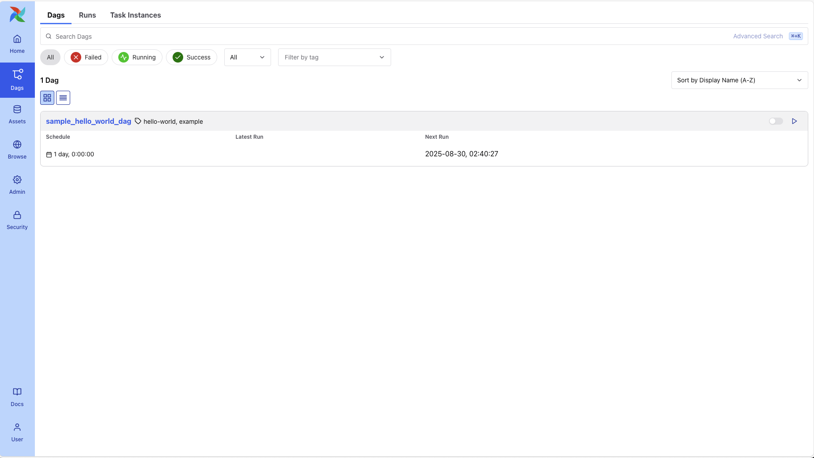

# Deploys latest Airflow on Openshift and Mount S3 Storage for DAGs

This guide deploys Airflow on OpenShift. Jump to the [Preload DAG on startup with S3 Object store]() section if you need to store your dags in S3 compatible object storage - ie. MinIO.



## Add Airflow Helm Repo
```shell
helm repo add apache-airflow https://airflow.apache.org
```

## Deployment

Create a new or point to your namespace.
```shell
oc new project airflow
oc project airflow
```

Run these before deploy, or use the [shell script](./airflow_pre.sh)

```shell
oc adm policy add-scc-to-user anyuid -z airflow-api-server
oc adm policy add-scc-to-user anyuid -z airflow-create-user-job
oc adm policy add-scc-to-user anyuid -z airflow-dag-processor
oc adm policy add-scc-to-user anyuid -z airflow-migrate-database-job
oc adm policy add-scc-to-user anyuid -z airflow-redis
oc adm policy add-scc-to-user anyuid -z airflow-scheduler
oc adm policy add-scc-to-user anyuid -z airflow-statsd
oc adm policy add-scc-to-user anyuid -z airflow-triggerer
oc adm policy add-scc-to-user anyuid -z airflow-worker
oc adm policy add-scc-to-user anyuid -z airflow-webserver
oc adm policy add-scc-to-user anyuid -z default
```
Then run

```shell
helm install airflow apache-airflow/airflow -f custom_values.yaml --namespace airflow
```

## Preload DAG on startup with S3 Object store

### Option 1: Side car mount - s3-sync
One time sync only. This is achieved via sidecar mounted on apiServer. Only apiServer will work for some reason even though the helm chart supports others.

```shell
helm install airflow apache-airflow/airflow -f airflow_values_v1.yaml --namespace airflow
```

```yaml
apiServer:
  extraContainers:
    - name: s3-sync-sidecar
      image: amazon/aws-cli:latest
      env:
        - name: AWS_ACCESS_KEY_ID
          valueFrom:
            secretKeyRef:
              name: minio-ak-sk
              key: access-key
        - name: AWS_SECRET_ACCESS_KEY
          valueFrom:
            secretKeyRef:
              name: minio-ak-sk
              key: secret-key
      command:
        - sh
        - -c
        - |
          # Initial sync
          echo "[$(date)] Start initial S3 DAGs sync in apiServer sidecar..."
          mkdir -p /opt/airflow/dags
          aws s3 sync \
            s3://BUCKET_PATH/dags/ /opt/airflow/dags \
            --endpoint-url YOUR_MINIO_URL \
            --no-verify-ssl \
            --delete
          chmod -R 775 /opt/airflow/dags
```

### Option 2: CRON Job to Pre-load in Persistent Volume [Recommended]
With this option, you can control the sync job on interval.

Deploy the base airflow follow by cronjob.
```shell
helm install airflow apache-airflow/airflow -f airflow_values_v2-1.yaml --namespace airflow
```
and 
```shell
helm install airflow apache-airflow/airflow -f airflow_values_v2-2.yaml --namespace airflow
```
Post deployment, patch the scheduler, dag-processor and worker so they read from the PVC. This is a one time operation.

Scheduler
```shell
oc patch deployment airflow-scheduler -n airflow --type=merge -p='{"spec":{"template":{"spec":{"containers":[{"name":"scheduler","volumeMounts":[{"name":"dags","mountPath":"/opt/airflow/dags"}]}],"volumes":[{"name":"dags","persistentVolumeClaim":{"claimName":"airflow-efs-dags"}}]}}}}'
```

Dag-processor
```shell
oc patch deployment airflow-dag-processor -n airflow --type=merge -p='{"spec":{"template":{"spec":{"containers":[{"name":"dag-processor","volumeMounts":[{"name":"dags","mountPath":"/opt/airflow/dags"}]}],"volumes":[{"name":"dags","persistentVolumeClaim":{"claimName":"airflow-efs-dags"}}]}}}}'
```

Worker
```shell
oc patch statefulset airflow-worker -n airflow --type=merge -p='{"spec":{"template":{"spec":{"containers":[{"name":"worker","volumeMounts":[{"name":"dags","mountPath":"/opt/airflow/dags"}]}],"volumes":[{"name":"dags","persistentVolumeClaim":{"claimName":"airflow-efs-dags"}}]}}}}'
```