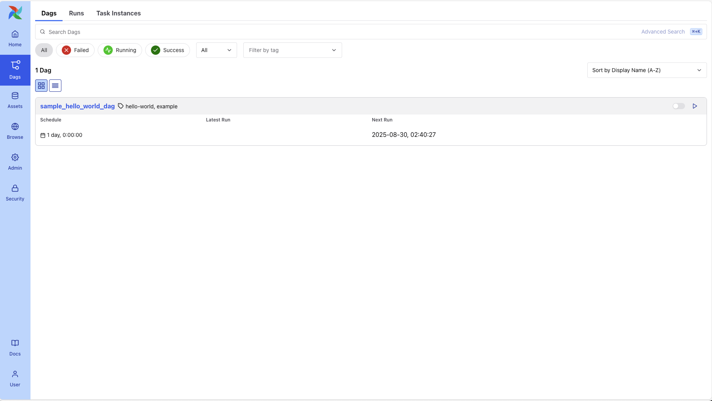

# Deploys latest Airflow on Openshift

This guide deploys Airflow on OpenShift. Jump to the knowledge base if you need to store your dags in S3 compatible object storage - ie. MinIO.



## Deployment
1. Create new project
    ```shell
    oc new project airflow
    oc project airflow
    ```
1. Add Helm Repo
    ```shell
    helm repo add apache-airflow https://airflow.apache.org
    ```

1. Give the correct permission to the service account
    ```shell
    oc adm policy add-scc-to-user anyuid -z airflow-api-server
    oc adm policy add-scc-to-user anyuid -z airflow-create-user-job
    oc adm policy add-scc-to-user anyuid -z airflow-dag-processor
    oc adm policy add-scc-to-user anyuid -z airflow-migrate-database-job
    oc adm policy add-scc-to-user anyuid -z airflow-redis
    oc adm policy add-scc-to-user anyuid -z airflow-scheduler
    oc adm policy add-scc-to-user anyuid -z airflow-statsd
    oc adm policy add-scc-to-user anyuid -z airflow-triggerer
    oc adm policy add-scc-to-user anyuid -z airflow-worker
    oc adm policy add-scc-to-user anyuid -z airflow-webserver
    oc adm policy add-scc-to-user anyuid -z default
    ```

1. Then run

    ```shell
    helm install airflow apache-airflow/airflow -f airflow-values.yaml --namespace airflow
    ```

### Post deploy
Comment out this 3 line for statefulset - airflow-postgresql
```yaml
   # RunAsUser: 1001
   # scccompProfile:
   #     type: RuntimeDefault
```
>Note: Without commenting out this, it will not run.

## Preload DAG on startup with S3 Object store

Using S3 object store to keep dags is **NOT RECOMMENDED**. Best practice is to use Git-sync as it gives you version control and would work out of the box. Refer official docs https://github.com/airflow-helm/charts/blob/main/charts/airflow/docs/faq/dags/load-dag-definitions.md for more information. 

Should you have requirement to enable this, read on.

Use a sidecar container to sync the dags to PV and mount/load into opt/airflow/dags.
Optionally, use the sidecar container to sync the dags from pv to airflow in an interval.

> Details in [***airflow-minio-values.yaml***](/airflow-minio-values.yaml)

### Post Deploy
Manual patching is required in order for ***Scheduler, DAG Processor, and Workers*** to mount the EFS volume.

* This is a one-time operation after deployment

```shell
kubectl patch \
  deployment/airflow-scheduler \
  deployment/airflow-dag-processor \
  statefulset/airflow-worker \
  -n airflow \
  --type='json' \
  -p='[
    {
      "op": "add",
      "path": "/spec/template/spec/volumes/-",
      "value": {
        "name": "dags",
        "persistentVolumeClaim": {
          "claimName": "airflow-efs-dags"
        }
      }
    },
    {
      "op": "add",
      "path": "/spec/template/spec/containers/0/volumeMounts/-",
      "value": {
        "name": "dags",
        "mountPath": "/opt/airflow/dags"
      }
    }
  ]'

```

# Knowledge Base
Airflow requires the volume to be **RWX - ReadWriteMany**. If your ROSA does not comes with EFS drivers, proceed below to install. In ARO, that would be Azure Files.
 
Enabling the AWS EFS CSI Driver Operator on ROSA
https://cloud.redhat.com/experts/rosa/aws-efs/

To deploy, helm install with airflow-minio-yaml values. Ensure to to create the pvc, aksk secret first.